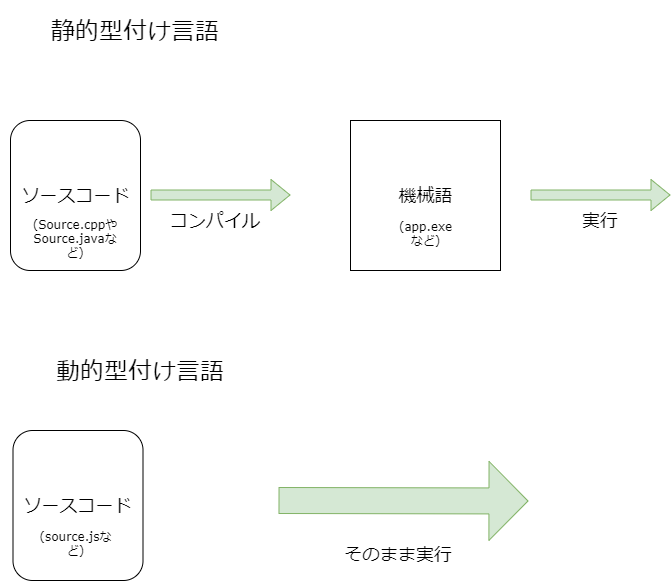

# C++の概要
この *Basic Functions of C++* ではC++言語について解説しています。  
そもそもプログラミング言語とは **コンピュータへの命令文** のことです。  
プログラミング言語が違えば、命令文の文法(書き方)も異なります。  
そして、コンピュータは内部で **2進数**(機械語) というフォーマット(0と1のみで成り立つ数字の羅列)でしか命令を認識して実行することができません。  
ですが、頭の悪い人類は0と1の羅列で命令を送ることはできません。  
人類にも分かりやすいフォーマットで記述する必要があります。  
  
そこでプログラミング言語の登場です。  
プログラミング言語は(一般的に)、人間の可読性が高く、それをある一連の操作をすることで機械語に翻訳(変換)してくれます。  
代表的なプログラミング言語はC++以外にはJavaScript, Python, PHP, Haskellなどがあげられます。  
これらは一重にプログラミング言語とくくられますが、彼らの持つ性質は異なります。  
まず、分類すべき点は **いつ、命令文(以下、ソースコード)を機械語に変換するか** です。  
  
C++, Javaなどは **コンパイル** という操作をして、ソースコードを機械語に変換したあとに、実行されます。このことからこれらは **コンパイル型言語(静的型付け言語)** と呼ばれます。  
逆に、JavascriptやPythonなどは、 **実行時に翻訳をします**(実行と翻訳を同時に行います)。これらは **動的型付け言語** と呼ばれます。  
(「型付け」とは何なのかは後の章で取り上げます)  

これらのことを図にするとこうなります。  

