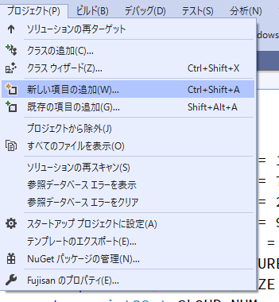
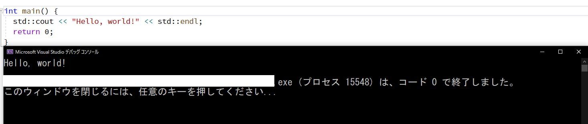

# 開発環境を整える
## はじめに
前章で説明した通り、C++を実行するには、  

1.コードを書く  
2.そのコードをコンパイルする  
3.実行する  

という3ステップが必要です。  
初心者の場合、Vimで書き、gccでコンパイルして～～みたいなことをするのは難しいと思います。  
しかし、この3ステップを同じソフトで行うことができ、そのソフトやその環境のことを **IDE(統合開発環境)** と呼びます。  
そしてC++のIDEで最も有名なのはやはりVisual Studioだと思います。(ほかのIDEよりもネット上の情報がはるかに多いです)  
Visual Studioのインストール方法は[このページ](https://asatte.biz/visual-studio-2017/)を参照してください。  

**ただし、現在(2020/03/20)ではVisual Studio2019が既にリリースされているので、それのインストーラーをダウンロードしてください。**
これのことですね。([Visual Studio公式ホームページ](https://visualstudio.microsoft.com/ja/downloads/)より)
  
また、さっきのページでは、インストールの際に「.NETデスクトップ開発」、「ASP.NETとWeb開発」などを選択していましたが、**C++の開発だけならば「C++によるデスクトップ環境」を選択するだけでいいです。**  


そして、インストールできたら、Visual Studioを起動し、
「新しいプロジェクトの作成」をクリック  
↓  
「空のプロジェクト」をクリック  
↓  
「次へ」をクリック
↓
プロジェクト名(適当でいいです。cpp_learningとか)と場所を設定(デフォルトでもよし)して、「作成」をクリック
  
これによって**プロジェクト**が作成されました。  
ちなみにプロジェクトとはVisual Studioで開発するための最小構成のものです。その中にプロジェクトの設定ファイルなどが入っています。  
しかし、作成した段階では、ソースコードが作成されていません。(文字通り「空の」プロジェクトなので)  
そしたら、「プロジェクト」→「新しい項目の追加」から新たなC++ファイルを作成してください。(名前はデフォルトのSource.cppで構いません)  

こんな感じ。  


すると、コードが書けるようになっているはずです。  
そこにこれを入力してください。(コピペで構いません)  
```cpp
#include <iostream>
int main(){
    std::cout << "Hello, world!" << std::endl;
    return 0;
}
```
できたら保存(Ctrl + S)して、実行(Ctrl + F5)してください。  
次のように表示されれば成功です。  
